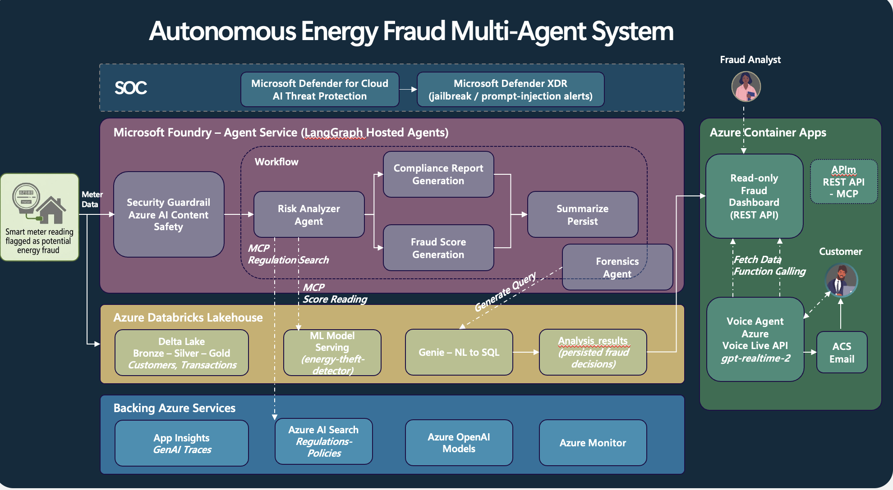
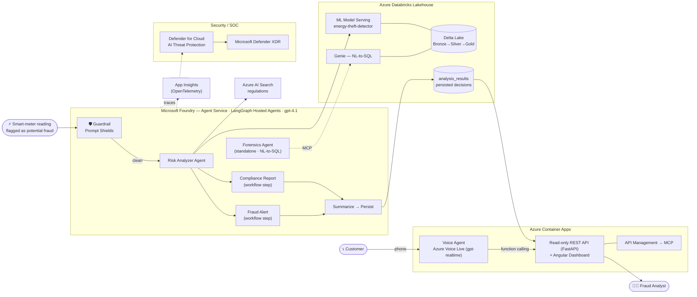
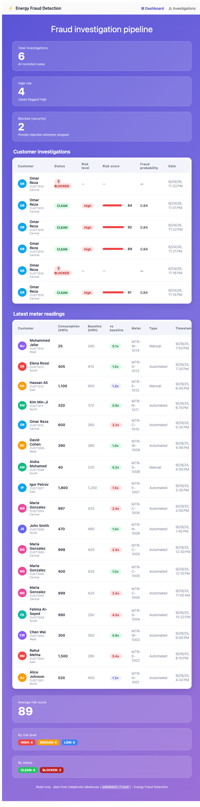

# ⚡ Energy Fraud Detection — Multi-Agent System on Microsoft Foundry + Databricks

A reference demo that detects **energy theft / fraud** with a team of **LangGraph
hosted agents** running on the **Microsoft Foundry Agent Service**, grounded in a
**Databricks lakehouse** (ML model + NL‑to‑SQL with Genie), protected by a
**security guardrail** (Azure AI Content Safety **Prompt Shields** +
**Microsoft Defender for Cloud AI threat protection**), and surfaced through a
read‑only **Angular dashboard** and a **voice agent** customers can call.

> Built for energy/utilities scenarios, but the pattern applies to any
> high‑stakes, regulated decisioning workload.

---

## Architecture

> Replace the placeholder below with your exported diagram at
> `docs/images/architecture.png`. A faithful Mermaid version is included as a
> fallback (GitHub renders it natively).





---

## What it does

| Piece | Description |
| --- | --- |
| **Risk Analyzer agent** | Scores a meter reading for fraud, delegating the numeric verdict to a **governed ML model on Databricks Model Serving** and grounding it in **real Spanish/EU electricity regulations** (e.g. Ley 24/2013 del Sector Eléctrico, RD 1955/2000) via **Azure AI Search**. |
| **Forensics agent** | Investigates a customer in the lakehouse using **natural language** (**Databricks Genie** NL‑to‑SQL, exposed as MCP tools). |
| **Workflow orchestrator** | A **LangGraph** graph: `guardrail → risk_analyzer → (compliance ∥ fraud_alert) → summarize → persist`. |
| **Security guardrail** | **Prompt Shields** inspects the reading for prompt‑injection **before any agent acts**; **Defender for Cloud AI** surfaces jailbreak attempts in **Defender XDR**. |
| **Dashboard** | Read‑only **Angular** app over a **FastAPI** backend; shows investigations, latest meter readings and KPIs. |
| **Voice agent** | **Azure Voice Live API** (`gpt-realtime`) agent a customer can **call by phone** (via **Azure Communication Services**) to ask about their investigation; uses function calling against the dashboard API and can email a summary. |
| **Observability** | OpenTelemetry → **Application Insights** (per‑node GenAI traces). |

### Dashboard



Clicking an investigation opens an analyst detail view (case status, customer
profile, the analysed reading, the decision and the derived risk factors).

---

## Repository structure

```
agents/                LangGraph hosted agents (Foundry Agent Service)
  risk_analyzer/        Risk Analyzer agent (ML + regulations)
  forensics/            Forensics agent (Genie NL-to-SQL via MCP)
  workflow/             Orchestrator graph (guardrail + fan-out + persist)
  shared/               Shared model, tools (ML serving, regulations, Prompt Shields, results store)
app/backend/           Read-only FastAPI API (serves the dashboard + the voice agent)
frontend/              Angular dashboard (read-only)
voice-agent/           Voice Live + ACS voice agent (web + phone)
databricks/            Lakehouse data export + medallion notes
infra/                 Bicep IaC for the Azure platform
scripts/               Helpers (e.g. sync_shared.sh)
```

---

## Prerequisites

- **Azure subscription** with rights to create resources.
- **Azure CLI** (`az`) + **azd** (`azure-dev`) + **Bicep**.
- **Databricks workspace** (Unity Catalog) with a SQL Warehouse — for the data, ML model and Genie.
- **Python 3.11+** and **Node.js ≥ 22.22.3** (for the Angular dashboard).
- A **Foundry resource with a realtime model** (e.g. `gpt-realtime`) for the voice agent.

---

## Deploy

### 1. Data & ML (Databricks)

Import the sample data and build the lakehouse:

- Load `databricks/data/customers.csv` and `databricks/data/transactions.csv`, or run `databricks/export_data.sql`.
- Train/register the energy‑theft ML model and create a **Model Serving** endpoint.
- Create a **Genie space** over the tables (for NL‑to‑SQL).

### 2. Azure platform (Bicep)

```bash
az group create -n rg-energy-fraud -l swedencentral
az deployment group create -g rg-energy-fraud \
  -f infra/main.bicep -p infra/main.parameters.json
```

This provisions Log Analytics + Application Insights, a Container Apps
Environment, an AI Foundry account with `gpt-4.1` (+ Content Safety), and Azure
AI Search. Use the deployment **outputs** to fill `.env` (see below).

> **Regulations index** — the Bicep provisions the Search service but not its
> content. Seed the `regulations-policies` index with energy-regulation snippets
> (`id`, `content`, `title`, `category`). The demo grounds the Risk Analyzer in
> **real, paraphrased Spanish/EU electricity regulations** (Ley 24/2013 del
> Sector Eléctrico, RD 1955/2000, RD 1110/2007, Directive (EU) 2019/944) covering
> meter tampering, illegal connections and supply suspension — not legal advice.

### 3. Hosted agents (Foundry Agent Service)

```bash
cp .env.example .env   # fill in the values
azd auth login
azd up                 # deploys risk-analyzer, forensics, workflow
```

> Each agent has an `agent.yaml` with `environment_variables`. Non‑secret values
> (Databricks serving URL, AI Search endpoint, Content Safety endpoint, warehouse
> id) are set there per deployment; secrets are referenced as `${NAME}` and read
> from the azd environment. Edit these to match your resources before `azd up`.

### 4. Dashboard (Azure Container Apps)

A single container builds the Angular app and serves it from the FastAPI backend:

```bash
az containerapp up \
  --name fraud-dashboard --resource-group rg-energy-fraud \
  --environment <aca-env-from-bicep-output> \
  --source . --ingress external --target-port 8000
# then set the Databricks config:
az containerapp secret set -n fraud-dashboard -g rg-energy-fraud \
  --secrets dbx-token=<databricks-pat>
az containerapp update -n fraud-dashboard -g rg-energy-fraud --set-env-vars \
  DATABRICKS_WORKSPACE_HOSTNAME=<workspace>.azuredatabricks.net \
  DATABRICKS_WAREHOUSE_ID=<warehouse-id> \
  LAKEHOUSE_SCHEMA=<catalog>.<schema> \
  MODEL_SERVING_TOKEN=secretref:dbx-token
```

### 5. Voice agent (Azure Container Apps)

```bash
cd voice-agent
az containerapp up \
  --name fraud-voice-agent --resource-group rg-energy-fraud \
  --environment <aca-env-from-bicep-output> \
  --source . --ingress external --target-port 8000
# Entra ID auth to Voice Live: give the app a managed identity + role
PID=$(az containerapp identity assign -n fraud-voice-agent -g rg-energy-fraud \
  --system-assigned --query principalId -o tsv)
az role assignment create --assignee-object-id $PID --assignee-principal-type ServicePrincipal \
  --role "Cognitive Services User" \
  --scope <voice-live-foundry-resource-id>
az containerapp update -n fraud-voice-agent -g rg-energy-fraud --min-replicas 1 --set-env-vars \
  AZURE_VOICE_LIVE_ENDPOINT=https://<foundry>.cognitiveservices.azure.com/ \
  VOICE_LIVE_MODEL=gpt-realtime \
  FRAUD_API_BASE_URL=https://<dashboard>.azurecontainerapps.io
```

**Phone calls (optional)** — in your Azure Communication Services resource, add an
**Event Subscription** for `IncomingCall` pointing to
`https://<voice-agent>.azurecontainerapps.io/acs/incomingcall`, and attach a
phone number. Set `ACS_CONNECTION_STRING` (as a secret) and `ACS_SENDER_EMAIL`.

### 6. Security

- **Prompt Shields** is part of the AI Foundry account (Content Safety) — the
  workflow guardrail calls it automatically.
- Enable **Defender for Cloud AI threat protection**:
  ```bash
  az security pricing create -n AI --tier Standard
  ```
  Jailbreak / prompt‑injection attempts against the model then surface as alerts
  in **Microsoft Defender XDR**.

---

## Run locally

```bash
# Backend API
cd app/backend && uvicorn main:app --reload --port 8000

# Dashboard (Node ≥ 22.22.3)
cd frontend && npm ci && npm start            # http://localhost:4200

# Voice agent (web mic test)
cd voice-agent && python -m venv .venv && ./.venv/bin/pip install -r requirements.txt
cp .env-sample.txt .env                        # fill in, then:
./.venv/bin/python server.py                   # http://localhost:8000 → "Start"
```

---

## Configuration

All deployment‑specific values are read from environment variables — see
[.env.example](.env.example) and [voice-agent/.env-sample.txt](voice-agent/.env-sample.txt).
**Never commit a real `.env`.**

---

## Security notes

This is a **proof of concept**. Before any production use:

- Replace token/key auth with **managed identities** and least‑privilege RBAC.
- Lock down CORS on the API (currently open for the local dev server).
- Rotate any credentials used during development.
- Review data handling and what the voice agent is allowed to disclose to callers.

---

## License

See [LICENSE](LICENSE).
